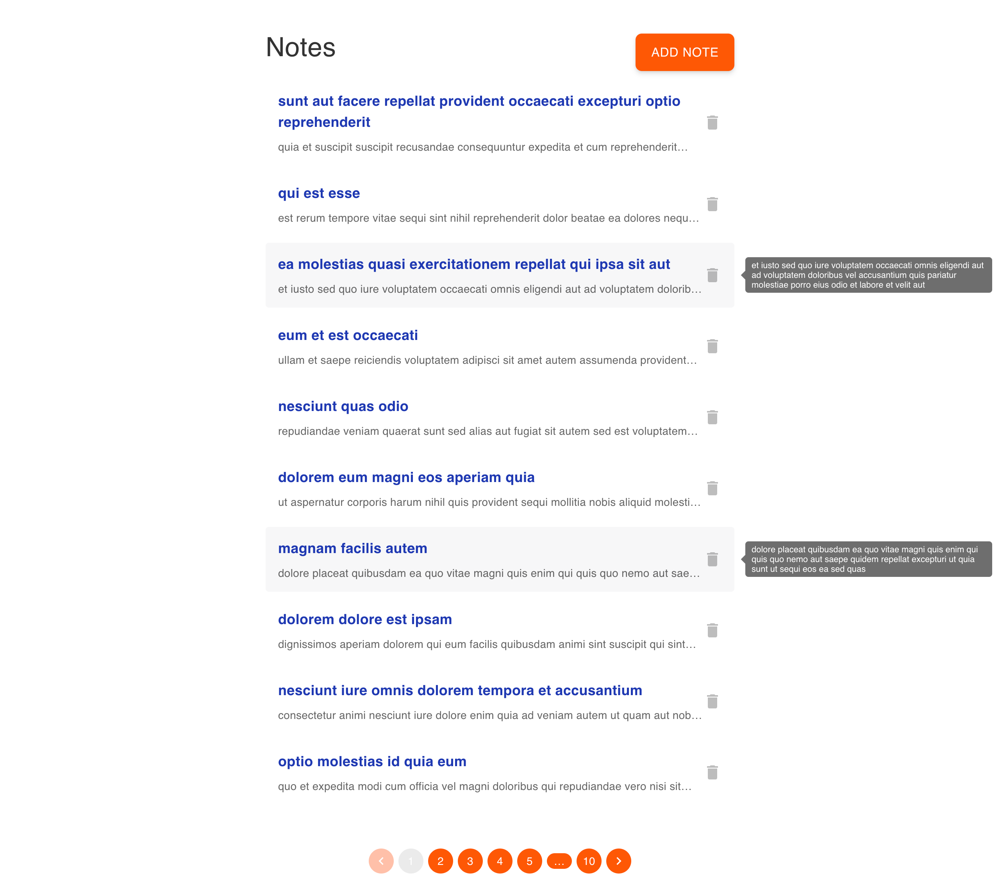
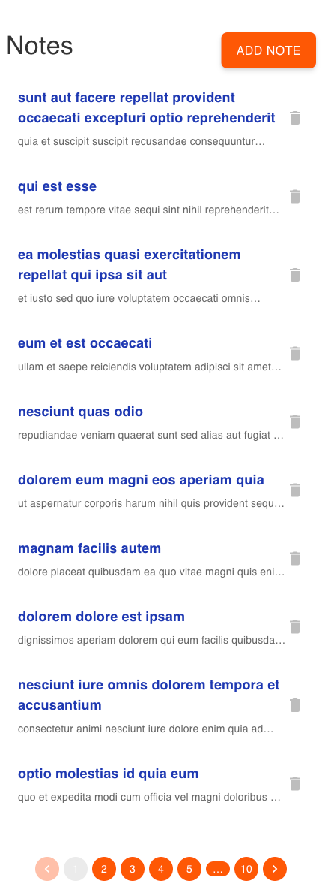
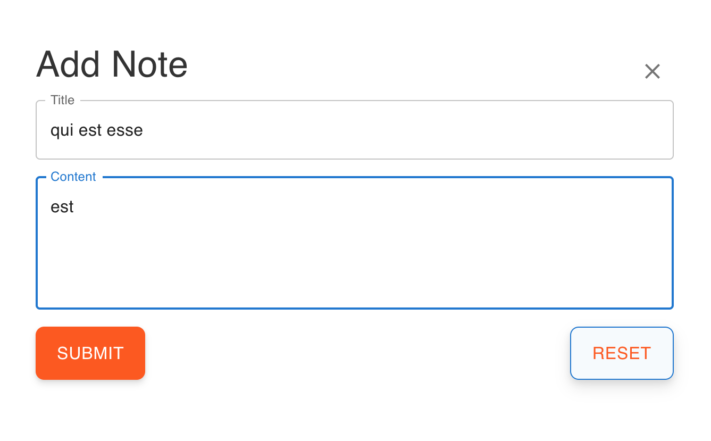

# Note Taking App

This is a simple note-taking application built with React and Redux.

## Screenshots

  

    <h3>Desktop</h3>
    
  

  

    <h3>Mobile</h3>
    
  

## Functionality

- Add, edit, and delete notes.
- Responsive design for both desktop and mobile devices.
- Notes are saved to the server using a RESTful API.

### Form Page

## How to Run

1. Clone this repository.
2. Navigate to the project directory.
3. Run `npm install` to install dependencies.
4. Run `npm start` to start the development server.
5. Open your browser and go to `http://localhost:3000` to view the app.

## Project Structure

- `public/`: Static assets and HTML template.
- `src/`: Source code.
  - `components/`: React components.
  - `redux/`: Redux store setup and slices.
  - `styles/`: CSS styles.
  - `App.js`: Main application component.
  - `index.js`: Entry point of the application.

## Tech Stack

- React
- TypeScript
- Redux
- React Router
- Axios
- Material-UI
- Formik

## Author

Olexandra Kunytska - Frontend developer
